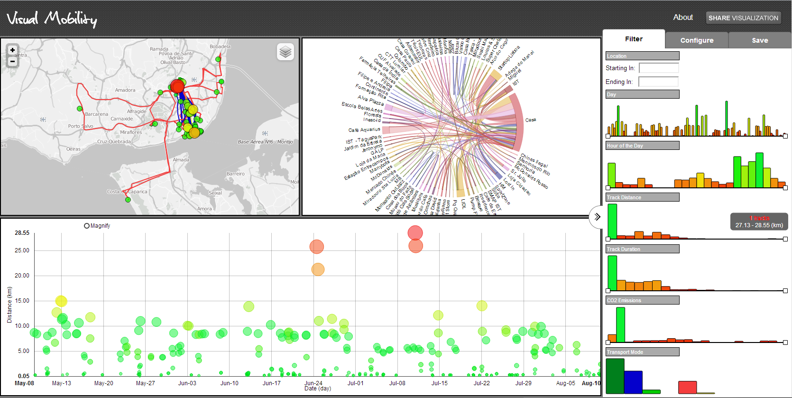

#VisualMobility

Visual Exploration Tool for Personal Analysis

Check out the live demo here:
[http://visualmobility.tk](http://visualmobility.tk) (Chrome only)

##Future Work

 * [Crossfilter](http://square.github.com/crossfilter/) integration
 * Remove [RaphaelJS](http://raphaeljs.com/) dependency on the Sidepanel. Change to [D3](http://d3js.org)+[Crossfilter](http://square.github.com/crossfilter/)
 * Better Data Collection tools
 * Authentication integration with [CartoDB](http://cartodb.com/)
 * Extend Server API to support filter and settings management
 * Support for Safari and Firefox
 * UI and code Optimization
